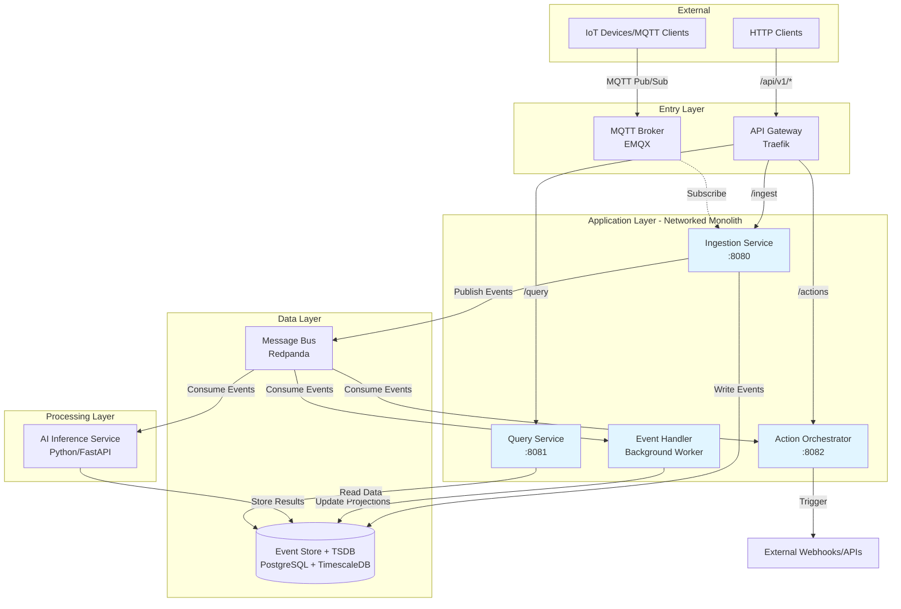

# ADR 0001: Event-Driven CQRS Architecture

* **Status:** Accepted
* **Date:** 2026-01-29
* **Architect:** David

## Context

The Cornjacket platform is designed as a high-performance infrastructure for data ingestion, real-time AI inference, and event orchestration (initially targeting IoT or security streams). The system must handle high-velocity "Write" traffic while remaining responsive to complex "Query" requests and AI-driven analysis.

### Key Requirements
- Support dual ingestion protocols (HTTP REST + MQTT) from distinct client types
- Decouple read and write paths to allow independent scaling
- Fan out events to multiple independent consumers (projections, AI, actions)
- Enable event replay within a retention window for recovery and reprocessing
- Support real-time AI inference on streaming data with sub-second action triggers

### Constraints
- Single-developer project (limits operational complexity and on-call capacity)
- Development/learning environment (cost-conscious, ~$50/month budget)
- Initial implementation as networked monolith
- AWS-focused deployment

## Decision

Implement an **event-driven architecture** with **Command Query Responsibility Segregation (CQRS)** using a **networked monolith** deployment pattern.

### Core Pattern: CQRS
- **Ingestion Service** handles writes (commands)
- **Query Service** handles reads (queries)
- Separate paths allow independent scaling and optimization

### Event-Driven Data Flow
- Centralized **message bus** (Redpanda) as the event backbone
- Events are published once and consumed by multiple independent consumers
- Decouples producers from consumers, provides backpressure management

### Networked Monolith
- Single Go binary running multiple HTTP servers on different ports (8080, 8081, 8082)
- Each port represents a future microservice (Ingestion, Query, Actions)
- Enforces service boundaries from day one
- Minimal migration effort when extracting to true microservices

### High-Level System Architecture

### Components

| Component | Responsibility |
|-----------|----------------|
| **Ingestion Service** | Validates incoming data, writes to outbox/event store, publishes to message bus |
| **Query Service** | Reads from projections/TSDB, returns aggregated or AI-enriched data |
| **Action Orchestrator** | Consumes events, triggers external webhooks/alerts based on rules |
| **Event Handler** | Consumes events, updates CQRS materialized projections |
| **AI Inference Service** | Consumes events for real-time anomaly detection and forecasting |

### Data Flow Patterns

**Write Path (Command):**
1. HTTP/MQTT request → Gateway/Broker → Ingestion Service
2. Ingestion validates → Writes to Outbox → Returns success to client
3. Background processor → Event Store + Message Bus → Deletes from Outbox
4. Consumers process asynchronously

**Read Path (Query):**
1. HTTP request → API Gateway → Query Service
2. Query Service reads from projections
3. Returns aggregated or AI-enriched data

**Action Path:**
1. AI Service detects anomaly → Publishes to Message Bus
2. Action Orchestrator consumes → Triggers external webhooks/alerts

## Rationale

- **CQRS:** Scaling requirements for writes (high-volume, low-latency) are fundamentally different from reads (complex aggregations). Separation prevents heavy queries from slowing down ingestion.
- **Event-driven:** Decouples components, enables event replay, supports multiple independent consumers.
- **Networked monolith:** Enforces service boundaries from day one while avoiding distributed systems complexity during initial development. Routing configuration remains nearly identical when splitting to microservices.
- **Message bus as unifier:** Acts as a buffer (pressure valve) to protect downstream services from traffic spikes.

## Consequences

### Benefits
- Hands-on experience with event-driven architecture and CQRS patterns
- Message bus enables independent scaling of consumers
- Clear migration path from monolith to microservices
- Event replay capability within retention window
- Decoupled components reduce blast radius of failures

### Trade-offs
- Distributed system debugging harder than simple monolith
- Eventual consistency between write and read sides requires careful handling
- More moving parts (6 containers in dev)
- Slower initial development due to architectural setup

## Related ADRs
- ADR-0002: Outbox-First Write Pattern
- ADR-0003: Unified PostgreSQL Data Stack
- ADR-0005: Infrastructure Technology Choices
