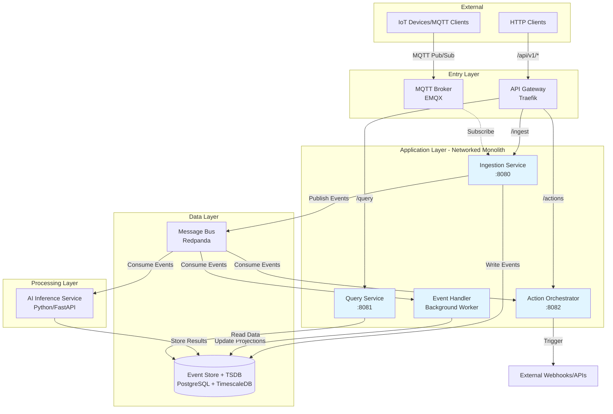
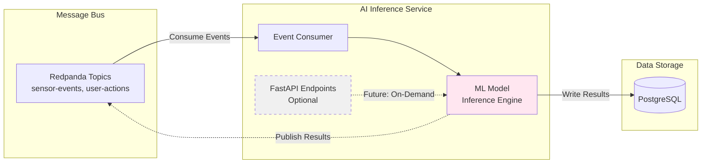
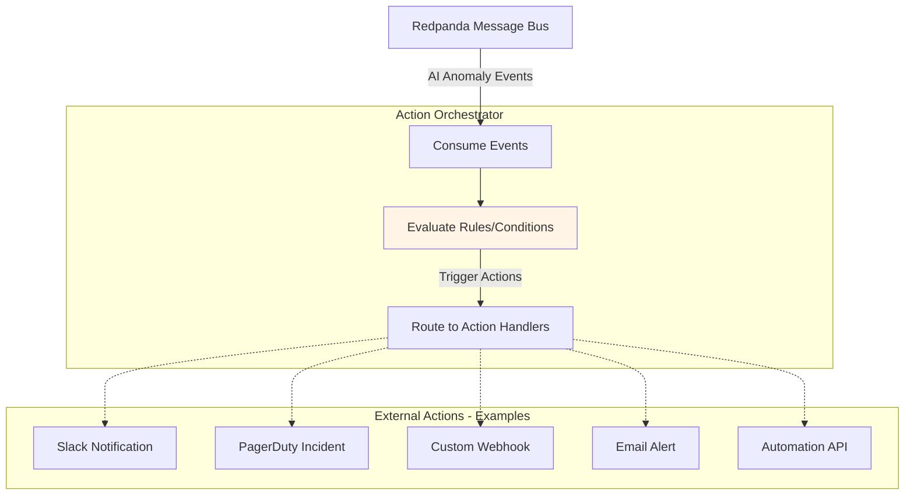

# ADR 0001: Initial Architecture Summary for Cornjacket Platform

* **Status:** Superseded
* **Date:** 2026-01-29
* **Architect:** David

---

> **NOTE:** This document has been superseded and split into focused ADRs:
>
> | ADR | Topic |
> |-----|-------|
> | [0001-event-driven-cqrs-architecture.md](0001-event-driven-cqrs-architecture.md) | Core CQRS pattern and networked monolith |
> | [0002-outbox-first-write-pattern.md](0002-outbox-first-write-pattern.md) | Write path consistency |
> | [0003-unified-postgresql-data-stack.md](0003-unified-postgresql-data-stack.md) | Database technology choice |
> | [0004-error-handling-philosophy.md](0004-error-handling-philosophy.md) | Delivery guarantees, DLQ, circuit breaker |
> | [0005-infrastructure-technology-choices.md](0005-infrastructure-technology-choices.md) | Traefik, EMQX, Redpanda |
> | [0006-security-model.md](0006-security-model.md) | Authentication and network security |
> | [0007-local-and-cloud-development-strategy.md](0007-local-and-cloud-development-strategy.md) | Dev environments and testing |
> | [0008-cicd-pipeline-strategy.md](0008-cicd-pipeline-strategy.md) | Build and deployment pipelines |
> | [0009-ai-inference-stream-processor.md](0009-ai-inference-stream-processor.md) | AI integration pattern |
>
> Operational details are in [../design-spec.md](../design-spec.md).
>
> **This document is preserved for historical reference only.**

---

## 1. Context and Problem Statement

### 1.1 Problem Statement
The Cornjacket platform is designed as a high-performance infrastructure for data 
ingestion, real-time AI inference, and event orchestration (initially targeting 
IoT or security streams). The goal is to practice advanced software engineering patterns including scalability, resilience, and "Security by Design."

The system must handle high-velocity "Write" traffic while remaining responsive to complex "Query" requests and AI-driven analysis.

### 1.2 Goals and Objectives
- Practice advanced software engineering patterns (CQRS, event-driven architecture)
- Build scalable, resilient system with "Security by Design"
- Create foundation for microservices migration
- Gain hands-on experience with production-grade technologies

### 1.3 Key Requirements
- Support dual ingestion protocols (HTTP REST + MQTT) from distinct client types
- Decouple read and write paths to allow independent scaling
- Fan out events to multiple independent consumers (projections, AI, actions)
- Enable event replay within a retention window for recovery and reprocessing
- Support real-time AI inference on streaming data with sub-second action triggers

### 1.4 Constraints
- Single-developer project (limits operational complexity and on-call capacity)
- Development/learning environment (cost-conscious, ~$50/month budget)
- Initial implementation as networked monolith
- AWS-focused deployment

### 1.5 Architecture Overview

### High-Level System Architecture


The Cornjacket platform follows an event-driven architecture with clear separation of concerns:

**Entry Layer:**
- API Gateway (Traefik) routes HTTP traffic to appropriate services
- MQTT Broker (EMQX) handles IoT device connections and pub/sub messaging

**Application Layer (Networked Monolith in Phase 1):**
- Ingestion Service validates and publishes incoming data
- Query Service provides read access to historical and real-time data
- Action Orchestrator triggers external actions based on events

**Data Layer:**
- Message Bus (Redpanda) decouples producers from consumers, provides backpressure management
- Event Store + TSDB (PostgreSQL + TimescaleDB) persists events and time-series data

**Processing Layer:**
- AI Inference Service consumes events for real-time anomaly detection and forecasting

### Data Flow Patterns

**Write Path (CQRS Command):**
1. HTTP/MQTT request → Gateway/Broker → Ingestion Service
2. Ingestion validates → Writes to Outbox table (PostgreSQL) → Returns success to client
3. Background processor → Writes to Event Store + Publishes to Message Bus → Deletes from Outbox
4. Consumers (AI, Orchestrator) process asynchronously

*(See Section 4.2 for full outbox pattern details)*

**Read Path (CQRS Query):**
1. HTTP request → API Gateway → Query Service
2. Query Service reads from PostgreSQL/TimescaleDB
3. Returns aggregated or AI-enriched data

**Action Path:**
1. AI Service detects anomaly → Publishes to Message Bus
2. Action Orchestrator consumes → Triggers external webhooks/alerts

## 2. Design Choices & Decisions

### 2.1 Entry Point Strategy: Parallel Entry
* **Decision:** Separate the entry points for different protocols. Use an **Off-the-shelf API Gateway** (e.g., Kong, Traefik) for HTTP traffic and an **Off-the-shelf MQTT Broker** (e.g., EMQX) for stateful TCP IoT traffic.
* **Reasoning:** Protocol isolation prevents long-lived MQTT connections from consuming resources needed by short-lived HTTP requests. Using off-the-shelf tools ensures battle-tested security and protocol compliance.

### 2.2 Data Flow Pattern: Event-Driven Message Bus
* **Decision:** Utilize a centralized **Message Bus** (e.g., Kafka or Redpanda) as the "unifier."
* **Reasoning:** Decouples ingestion from processing. It acts as a buffer (pressure valve) to protect downstream databases (TSDB) and AI services from traffic spikes (backpressure management).

### 2.3 Structural Philosophy: CQRS
* **Decision:** Implement **Command Query Responsibility Segregation**. 
    * The **Ingestion Service** handles writes.
    * The **Query API** handles reads and data retrieval.
* **Reasoning:** Scaling requirements for writes (high-volume, low-latency) are fundamentally different from reads (complex aggregations, AI-enriched data). This prevents heavy queries from slowing down data ingestion.

### 2.4 AI Integration: In-Flight Inference
* **Decision:** Deploy the AI Inference engine as a **Stream Processor/Consumer** on the message bus.
* **Reasoning:** Allows for real-time anomaly detection and predictive actions. Data is enriched *before* it hits the permanent storage (TSDB), enabling immediate responses via the Action Orchestrator.

### 2.5 Build vs. Buy: Hybrid Integration
* **Decision:** Use off-the-shelf software for infrastructure (Gateway, Broker, Bus, TSDB). Develop **Custom Go Services** for business logic, ingestion validation, and action orchestration. Develop **Custom Python Services** for AI modeling.
* **Reasoning:** Focuses engineering effort on the unique architectural logic and AI implementation rather than reinventing standard networking protocols.

### 2.6 Deployment & Infrastructure - Development Environment

#### Decision: Networked Monolith with Sidecar Pattern
* **Architecture:** 
  - Single Go binary running multiple HTTP servers on different ports (8080, 8081, 8082)
  - Each port represents a future microservice (Ingestion, Query, Actions)
  - Traefik sidecar provides single entry point with path-based routing
  - EMQX sidecar for MQTT
  - No load balancer - direct task IP access

* **Reasoning:** 
  - Enforces service boundaries from day one
  - Routing configuration remains nearly identical when splitting to microservices
  - Minimal migration effort - extract servers to containers, update gateway targets
  - Realistic interface contracts despite monolithic deployment

* **Trade-offs:** 
  - Slightly more complex than single-port monolith
  - Sidecar overhead
  - Acceptable for learning proper architecture patterns

### 2.7 Local Development Environment

* **Decision:** Hybrid local setup — infrastructure in `docker-compose`, application code runs natively
* **Architecture:**
  - `docker-compose.yml` in `platform-services/` runs infrastructure only: Postgres, Redpanda, EMQX, Traefik
  - Go binary runs natively on the host (compiled and executed directly)
  - Python AI Inference Service runs natively on the host (e.g., `uvicorn` / `python main.py`)
  - Application processes connect to containerized infrastructure via `localhost`
* **Reasoning:**
  - Native execution eliminates container rebuild cycles — compile and restart immediately
  - Sub-second feedback loop for Go (`go run` / `go build`) and Python (no build step)
  - Infrastructure containers are stable and rarely change, so container overhead is justified for them
  - Matches how most developers already work (editor + terminal + containers for deps)
* **Trade-offs:**
  - Local environment differs from ECS (native processes vs. all-container) — container-specific bugs may only surface in AWS dev
  - Requires Go toolchain and Python virtualenv installed on host
  - No Terraform or IAM simulation locally — AWS-specific behavior tested in dev environment only
* **Decision deferred:**
  - Hot-reload tooling for Go (e.g., `air`, `gow`) vs. manual restart
  - Python virtualenv management (venv, poetry, etc.)
  - AI Inference Service port assignment for local development

### 2.8 Observability

#### Logging
* **Decision:** CloudWatch Logs with structured JSON format
* **Reasoning:** 
  - AWS-native integration with ECS (automatic log driver)
  - Structured JSON enables queryable logs and easier debugging
  - No additional infrastructure to manage in dev
* **Trade-offs:** CloudWatch query language less powerful than Elasticsearch, 
  but sufficient for dev environment

#### Metrics
* **Decision:** AWS CloudWatch Metrics (basic/automatic metrics)
* **Reasoning:** 
  - Zero setup - ECS provides CPU, memory, network metrics automatically
  - Sufficient for dev environment monitoring
  - Can add custom application metrics later via CloudWatch SDK
* **Trade-offs:** Less granular than Prometheus, acceptable for initial phase

#### Distributed Tracing
* **Decision:** Instrument code with OpenTelemetry, defer trace collection to later phase
* **Reasoning:** 
  - Adding instrumentation now is low-cost (library imports, trace context propagation)
  - Enables tracing across monolith's internal servers (port-to-port calls)
  - Honeycomb backend ready when needed (prior experience reduces learning curve)
  - Can enable/disable collection without code changes
* **Trade-offs:** Unused instrumentation adds minor overhead, but provides 
  migration path to full observability

#### Dashboards & Visualization
* **Decision:** Traefik dashboard for request routing + CloudWatch console for logs/metrics
* **Reasoning:** 
  - Traefik dashboard provides real-time view of traffic routing (validates gateway config)
  - CloudWatch console sufficient for ad-hoc log searches and metric viewing in dev
  - No additional infrastructure (Grafana) needed initially
* **Trade-offs:** Less sophisticated visualization than Grafana, acceptable for dev

## 3. Subsystem Overview

| Subsystem | Tech Category | Responsibility |
| :--- | :--- | :--- |
| **API Gateway** | Off-the-shelf | HTTP Auth, Rate-limiting, Routing. |
| **MQTT Broker** | Off-the-shelf | Managing IoT device connections and Pub/Sub. |
| **Message Bus** | Infrastructure | Central data pipeline (Kafka/Redpanda). |
| **Event Handler** | Custom (Go) | Consuming events from bus; updating CQRS materialized projections. |
| **Ingestion Service** | Custom (Go) | Validating and cleaning data; pushing to Bus. |
| **AI Inference** | Custom (Python) | In-flight anomaly detection and forecasting. |
| **TSDB** | Database | Long-term historical storage (PostgreSQL + TimescaleDB). |
| **Query API** | Custom (Go) | Serving data and AI insights via HTTP. |
| **Action Orchestrator**| Custom (Go) | Triggering webhooks/alerts based on AI logic. |

### 3.1 Message Bus

#### Technology Choice
* **Decision:** Kafka-compatible message bus (Redpanda)
* **Reasoning:** 
  - Kafka ecosystem is industry standard
  - Redpanda simpler than Kafka (no Zookeeper)
  - Compatible with standard Kafka client libraries
  - Works locally and in AWS

#### Deployment Architecture
* **Decision:** Sidecar — Redpanda container within the monolith ECS task
* **Reasoning:**
  - Simpler deployment, single task to manage
  - Consistent with the sidecar pattern used for Postgres and EMQX
  - Sufficient for dev-scale traffic
* **Trade-offs:**
  - Resource contention with other containers in the shared task
  - Coupled lifecycle (Redpanda restarts if the task restarts)
* **Decision deferred:** Extraction to a standalone ECS service for production if independent scaling is needed

### 3.2 Database & Event Store
* **Decision:** Single PostgreSQL instance with TimescaleDB extension
  - Serves as both event store (CQRS) and time-series database
  - Separate schemas for event store vs. time-series data

* **Reasoning:**
  - Single database technology simplifies the operational stack — one set of connection libraries, one query language (SQL), one backup strategy, one container to manage
  - TimescaleDB extends Postgres with time-series capabilities (hypertables, continuous aggregates, compression) without introducing a separate system like InfluxDB
  - Avoids dual-database complexity: no need for separate drivers, connection pools, health checks, or data synchronization between an event store and a dedicated TSDB
  - PostgreSQL ecosystem is mature and well-understood — extensive tooling, monitoring, and community support
  - Reduces cognitive overhead for a single-developer project

* **Event Store Schema (append-only, CQRS write side):**

  | Column | Type | Purpose |
  |--------|------|---------|
  | event_id | UUID | Unique identifier per event |
  | event_type | STRING | Discriminator (e.g., `sensor.reading`, `user.action`) |
  | aggregate_id | STRING | Groups related events (e.g., device ID, session ID) |
  | timestamp | TIMESTAMPTZ | When the event occurred |
  | payload | JSONB | Event-specific data |
  | metadata | JSONB | Trace IDs, source info, schema version |

* **Time-Series Schema:**
  - Each customer project defines its own TimescaleDB schema tailored to its specific data model
  - Schemas use typed columns (not JSONB) for known, structured time-series data to optimize storage and query performance
  - The Event Handler transforms events from the bus into the appropriate project-specific schema
  - Decision deferred: Schema provisioning and multi-tenant isolation strategy

* **Deployment (Dev):** Postgres as sidecar container with persistent volume
  - Acceptable for low-traffic dev environment
  - Requires EFS/EBS mount for data persistence

* **Trade-offs:**
  - Cannot scale event store and TSDB independently
  - A dedicated TSDB (InfluxDB, QuestDB) may outperform TimescaleDB for pure time-series workloads at high volume — acceptable given dev-scale traffic
  - Deferred decision: Separate instances for staging/prod if needed

### 3.3 Message Format

* **Decision:** JSON for initial development, migrate to binary format (Protobuf or MessagePack) for production
* **Scope:** The same JSON event envelope is used consistently across the outbox table, event store, and Redpanda message bus. The Ingestion Service serializes once to the outbox; the background processor copies the same structure to the event store and Redpanda without transformation.
* **Reasoning:**
  - Single serialization path simplifies the Ingestion Service — no transformation between bus and store
  - JSON enables fast iteration on event schemas during development
  - Human-readable for debugging across both Redpanda and Postgres
  - No build tooling complexity initially
  - Binary format migration deferred until schema stabilizes and performance requirements are clear
* **Trade-offs:** 
  - Larger payload size in dev (acceptable for low volume)
  - Migration effort required later
  - Decision deferred: Protobuf vs. MessagePack based on schema stability needs and performance testing

### 3.4 AI Inference Service Framework

* **Decision:** Python service using FastAPI framework, operating as stream processor
* **Architecture Pattern:** Pure stream processor (Pattern A)
  - Consumes events from Redpanda continuously
  - Runs inference on ML models
  - Writes results to PostgreSQL or publishes back to Redpanda
  - FastAPI provides HTTP endpoints if on-demand queries needed later
* **Reasoning:** 
  - Python provides best ML/AI library ecosystem for experimentation
  - FastAPI enables both async event processing and HTTP API capability
  - Stream processing pattern supports real-time inference on incoming events
  - Framework choice supports future hybrid pattern (stream + on-demand API)
* **Trade-offs:** 
  - Python slower than compiled languages (acceptable for learning project)
  - Can migrate to Go-Python hybrid if performance becomes critical
* **Deployment:**
  - **AWS dev:** Sidecar container within the ECS task, consistent with the other infrastructure containers
  - **Local dev:** Runs natively on the host (e.g., `uvicorn` / `python main.py`), consistent with the Go binary
* **Decision deferred:**
  - Specific ML use case and models (anomaly detection, forecasting, classification, etc.)
  - Model deployment and versioning strategy
  - Whether to add on-demand API pattern (Pattern B) in addition to stream processing



## 4. Operational Details

### 4.0 Dev Environment Task Architecture

**ECS Task Composition:**

| Container | Purpose | Ports | Volume Mounts |
|-----------|---------|-------|---------------|
| **traefik** | API Gateway / Router | 80 (HTTP entry), 8180 (dashboard) | Config volume |
| **app** | Go Monolith | 8080 (ingestion), 8081 (query), 8082 (actions) | None |
| **mqtt-broker** | EMQX MQTT Broker | 1883 (MQTT), 18083 (dashboard) | EFS/EBS for persistence |
| **redpanda** | Message Bus | 9092 (Kafka API), 9644 (admin) | EFS/EBS for persistence |
| **postgres** | Event Store + TSDB | 5432 (internal only) | EFS/EBS for persistence |
| **ai-inference** | AI Inference Service (Python/FastAPI) | 8090 (HTTP, internal only) | None |

**Communication Patterns:**
- External → Traefik (port 80) → App ports (8080/8081/8082)
- External → MQTT (port 1883) → EMQX
- IoT devices → EMQX → App (subscribes to MQTT topics)
- App → Postgres (localhost:5432) - event store reads/writes
- App → Redpanda (localhost:9092) - publish events
- App → MQTT (localhost:1883) - subscribe to device messages

**Persistent Storage:**
- **Decision deferred:** EFS vs. EBS for container data persistence
- **Required for:** postgres (event store + time-series data), redpanda (message buffer), mqtt-broker (sessions/config)
- **Not required for:** app (stateless container, uses Postgres for data), traefik (config from volume)

**Resource Allocation (Dev):**
- **Allocation:** 1 vCPU, 2GB memory (total task)
- **Rationale:** Cost optimization for dev environment, acceptable slow performance
- **Monitoring:** Watch for memory pressure/thrashing via CloudWatch, scale up if needed
- **Decision deferred:** Per-container resource limits based on profiling

**Access Patterns:**
- HTTP API: `http://<task-ip>/api/v1/*`
- MQTT: `mqtt://<task-ip>:1883`
- Traefik Dashboard: `http://<task-ip>:8180`
- EMQX Dashboard: `http://<task-ip>:18083`
- Redpanda Admin: `http://<task-ip>:9644`

**Cost Estimate (Dev):**
- ECS Fargate: ~$30-40/month (1 vCPU, 2GB, running 24/7)
- EFS storage: ~$5-10/month
- Logs/metrics: ~$5/month
- **Total: ~$40-55/month**

### 4.1 Message Bus Configuration

#### Topic Design
* **Decision:** Per-event-type topics (sensor-events, user-actions, system-events)
* **Reasoning:** Clean separation, consumers subscribe to needed types, avoids topic explosion

#### Retention Policy
* **Decision:** 24 hours for dev environment
* **Reasoning:** Cost-effective, sufficient for testing and debugging

#### Partition Strategy
* **Decision:** 1 partition per topic for dev environment
* **Reasoning:** Simplest configuration, guaranteed ordering, sufficient for low-traffic dev
* **Decision deferred:** Multi-partition strategy for production based on volume requirements

#### Dead Letter Queue
* **Decision deferred:** Per-consumer implementation choice
* **Reasoning:** Different consumers have different failure handling needs (retry vs DLQ vs log-and-continue)

### 4.2 CQRS Data Flow & Consistency

#### Write Path (Command Side)

The write path uses an **outbox-first pattern** to guarantee durability and avoid dual-write consistency issues.

**Step 1 — Ingestion (synchronous, client-facing):**
1. Ingestion Service receives HTTP/MQTT request
2. Validates the incoming event
3. Writes to the **outbox table** (with retry on failure, 2-3 attempts with backoff)
4. Returns success to client once outbox write succeeds — this is the "accepted" acknowledgment

**Step 2 — Processing (asynchronous, background):**
1. Background processor LISTENs for Postgres NOTIFY on outbox inserts (with periodic fallback poll for reliability)
2. Writes event to the **event store** (append-only, immutable)
3. Publishes event to **Redpanda** message bus
4. Deletes the outbox row only after both succeed
5. If either fails, the outbox entry remains and the entire operation retries

**Outbox Table Schema:**

| Column | Type | Purpose |
|--------|------|---------|
| outbox_id | UUID | Unique identifier |
| created_at | TIMESTAMPTZ | When the event was accepted |
| event_payload | JSONB | The full event envelope (same format as event store) |
| retry_count | INTEGER | Number of processing attempts (for monitoring/alerting) |

#### Read Path (Query Side)

- Event Handler consumes from Redpanda
- Updates materialized projections in Postgres (optimized for queries)
- Query Service reads from projections

#### Consistency Guarantees

* **Durability:** An event is durably captured the moment the outbox write succeeds. No accepted event is ever lost.
* **Atomicity:** The event store write and Redpanda publish are handled together — if either fails, both retry. No partial state.
* **Eventual consistency:** The event store and message bus are eventually consistent with the outbox. Lag is typically milliseconds under normal operation.
* **Immutability:** The event store is append-only. The outbox is transient (events are deleted after processing). Clean separation of concerns.
* **Retryability:** Failed processing is automatically retried. The outbox serves as a durable retry queue.

* **Consumers:**
  - Event Handler: Updates CQRS projections
  - AI Inference Service: Real-time analysis
  - Action Orchestrator: Triggers webhooks/alerts
  - All consume same events independently

### 4.3 Action Orchestrator

The Action Orchestrator consumes events from the message bus and triggers external 
actions based on defined rules and conditions. This enables real-time responses to 
AI-detected anomalies and other critical events.

#### Example Action Flow



*Note: Specific actions and integrations are examples — actual implementation deferred to use case definition.*

#### Webhook Retry Logic
* **Decision:** Exponential backoff with maximum retry attempts
  - Initial defaults (subject to tuning): 3-5 retry attempts with delays (1s, 2s, 4s, 8s, 16s)
  - After max retries: Log failure and continue processing
* **Reasoning:** 
  - Industry standard pattern for handling transient failures
  - Prevents hammering failing endpoints
  - Provides visibility through logging in dev environment
* **Trade-offs:** 
  - Some webhooks may fail permanently (acceptable for dev)
  - No automatic recovery mechanism for consistently failing endpoints
* **Decision deferred:** 
  - Circuit breaker pattern for production (mark endpoints as down after repeated failures)
  - Operator dashboard for manual endpoint health management
  - Dead letter queue for failed webhooks requiring manual intervention

#### Timeout Handling
* **Decision:** Per-webhook timeout with initial default of 30 seconds (subject to tuning)
* **Reasoning:**
  - Accommodates slow external services
  - Prevents indefinite blocking
  - Reasonable starting point for dev testing with external APIs
* **Decision deferred:** Production timeout tuning based on SLA requirements

#### Rate Limiting
* **Decision:** Simple global rate limit with initial default of 10 webhooks per minute (subject to tuning)
* **Implementation:** In-memory tracking in Action Orchestrator service
* **Reasoning:**
  - Protects external services from being overwhelmed
  - Prevents accidental spam during development and testing
  - Sufficient for single-instance dev environment
* **Decision deferred:** 
  - Per-endpoint rate limits for production
  - Shared state management (Redis) for multi-instance deployments

#### Deduplication
* **Decision:** Skip duplicate alerts within a time window, initial default of 5 minutes (subject to tuning)
* **Implementation:** In-memory cache of recent events (event type + target identifier)
* **Reasoning:** 
  - Prevents redundant notifications from repeated events
  - Reduces noise in alert channels
  - Simple implementation for dev environment
* **Trade-offs:** 
  - May suppress legitimate repeat alerts (acceptable for dev)
  - In-memory state lost on service restart (acceptable for dev)
* **Decision deferred:** 
  - Sophisticated deduplication logic (similarity matching, alert grouping)
  - Persistent deduplication state (Redis) for production multi-instance deployments

## 5. Scale & Performance Requirements

### 5.1 Target Throughput (Dev Environment)

* **Expected Load:** Low traffic (1-10 events/second)
  - HTTP API: ~10 requests/second
  - MQTT events: ~10 events/second
* **Reasoning:** Dev environment for testing and development, not production scale. These targets are intentionally orders of magnitude below production ambitions to optimize for cost and simplicity during the learning phase.
* **Decision deferred:** Production throughput requirements based on actual use case and load testing

### 5.2 Latency Requirements (Dev Environment)

* **Ingestion latency:** < 500ms (HTTP request to accepted response)
* **End-to-end latency:** < 5 seconds (event received to projection updated)
* **Query latency:** < 1 second (query response time)
* **Reasoning:** 
  - Relaxed requirements appropriate for dev environment
  - Focus on correctness over performance
  - Eventual consistency acceptable
* **Decision deferred:** Production SLAs (p50, p95, p99 latency targets) based on business requirements

### 5.3 Data Retention Policies

* **Postgres Event Store:** 7 days
* **Postgres Projections/TSDB:** 7 days  
* **Redpanda Message Bus:** 24 hours
* **Reasoning:** 
  - Cost optimization for dev environment
  - Sufficient for testing and debugging
  - Event replay available within retention window
* **Decision deferred:** 
  - Production retention requirements (30/90/365 days or longer)
  - Archival strategy for long-term storage
  - Compliance/regulatory retention requirements

## 6. Security

### 6.1 Authentication & Authorization

#### HTTP API
* **Decision:** JWT-based authentication validated at the API Gateway (Traefik)
* **Reasoning:**
  - Industry standard token-based auth
  - Stateless (no session management needed)
  - Centralized auth at the gateway keeps application code simpler
  - Rejected requests never reach the application layer
* **Implementation:** Traefik ForwardAuth middleware or JWT plugin
* **Decision deferred:**
  - Authorization/RBAC policies (may require app-layer logic for fine-grained permissions)
  - JWT token lifetime and refresh strategy
  - Identity provider integration

#### MQTT
* **Decision:** Username/password authentication (EMQX built-in)
* **Reasoning:** 
  - Simple, sufficient for dev environment
  - EMQX native support, no additional infrastructure
* **Decision deferred:** 
  - Client certificate authentication (mutual TLS) for production
  - Fine-grained ACL policies per device/topic

### 6.2 Secrets Management

* **Decision:** Hybrid approach based on environment
  - **Local development:** Environment variables from `.env` files
  - **AWS dev environment:** AWS Secrets Manager
* **Reasoning:** 
  - Local dev remains simple without AWS dependencies
  - AWS dev uses proper secrets management practices
  - Same application code supports both environments with fallback logic
  - Prepares migration path to production
* **Secrets managed:**
  - JWT signing keys
  - Database credentials
  - MQTT broker passwords
  - External service API keys
* **Decision deferred:** 
  - Secret rotation policies
  - Access audit logging
  - HashiCorp Vault evaluation for production

### 6.3 Network Security

#### Dev Environment Security Posture
* **Decision:** Relaxed security policies for development convenience
  - **Public exposure:** HTTP (port 80), MQTT (port 1883), dashboards (Traefik 8180, EMQX 18083)
  - **Internal only:** Postgres (5432), Redpanda (9092) - no public internet access
  - **Security groups:** Allow broad IP ranges for testing flexibility
  - **No TLS:** Plain HTTP and MQTT (simpler debugging in dev)
  - **No encryption at rest:** Unencrypted EFS volumes

* **Reasoning:**
  - Development environment not exposed to production traffic
  - Simplified debugging and testing
  - Cost optimization (no certificate management)

* **Decision deferred:**
  - TLS/HTTPS for all HTTP traffic (production requirement)
  - MQTT over TLS (production requirement)
  - Encryption at rest for persistent volumes
  - Strict security group policies (least privilege)
  - VPC isolation and network segmentation
  - WAF and DDoS protection

### 6.4 Inter-Service Authentication

* **Current state:** All containers share the same ECS task and communicate over localhost. No inter-service authentication is required — services trust each other implicitly within the task boundary.
* **Decision deferred:** When services are extracted to separate ECS tasks/services for production:
  - Mutual TLS (mTLS) between services
  - Service mesh (e.g., AWS App Mesh) for identity and traffic management
  - IAM-based authentication for AWS-native service-to-service calls

### 6.5 Input Validation

* **Decision:** Validate all external input at the system boundary (Ingestion Service)
* **Principles:**
  - Reject malformed payloads before processing (schema validation)
  - Enforce size limits to prevent resource exhaustion
  - Sanitize or reject unexpected/dangerous content
  - Rate limit per client to prevent abuse
  - Fail closed — reject uncertain input rather than accepting it
* **Reasoning:**
  - External data (HTTP, MQTT) is untrusted by default
  - Validation at the boundary protects all downstream components
  - Consistent with "Security by Design" goal
* **Decision deferred:**
  - Specific schema validation library/approach
  - Exact size limits and rate limits per endpoint
  - Sanitization rules based on payload content types

## 7. Disaster Recovery

### 7.1 Backup Strategy

* **Decision:** No formal backup strategy for dev environment
* **Reasoning:** 
  - Dev environment data not business-critical
  - Test data can be regenerated as needed
  - Cost optimization (no backup storage costs)
  - Infrastructure-as-code (Terraform) enables rapid rebuild
* **Data at risk:**
  - Postgres: Event store and projections (7-day retention)
  - Redpanda: Message buffer (24-hour retention)
  - EMQX: Session and configuration data
* **Decision deferred:** 
  - Production backup strategy (automated snapshots, point-in-time recovery)
  - Backup retention policies
  - Cross-region backup replication

### 7.2 Recovery Procedures

* **Decision:** Manual recovery via infrastructure rebuild
* **Recovery approach:**
  1. Redeploy infrastructure using Terraform
  2. Deploy latest application containers
  3. Regenerate test data using seed scripts
* **Reasoning:** 
  - Simple, repeatable process for dev
  - Infrastructure-as-code provides disaster recovery documentation
  - Acceptable downtime for non-production environment
* **Decision deferred:** 
  - Automated failover mechanisms
  - Blue-green deployment for zero-downtime recovery
  - Runbooks for production incident response

### 7.3 Recovery Objectives

* **RTO (Recovery Time Objective):** No strict requirement
  - Acceptable: Several hours to redeploy from scratch
  - Manual intervention acceptable
* **RPO (Recovery Point Objective):** No strict requirement  
  - Data loss acceptable in dev environment
  - Can regenerate test datasets
* **Reasoning:** 
  - Dev environment not serving production traffic
  - Learning/experimentation focus over availability
* **Decision deferred:** 
  - Production RTO/RPO targets based on business requirements
  - SLA commitments
  - Disaster recovery testing procedures

## 8. Consequences

### 8.1 Benefits

**Architectural Learning:**
- Hands-on experience with event-driven architecture, CQRS, and microservices patterns
- Practice with industry-standard technologies (Kafka-compatible systems, time-series databases)
- Enforced service boundaries from day one through networked monolith approach

**Scalability Foundation:**
- Message bus enables independent scaling of consumers
- CQRS separates read/write workloads for optimization
- Clear migration path from monolith to microservices with minimal code changes

**Operational Flexibility:**
- Multiple consumers process same events independently
- Event replay capability within retention window
- Decoupled components reduce blast radius of failures

**Real-time Capabilities:**
- AI inference on streaming data
- Immediate action orchestration based on events
- Low-latency ingestion path

### 8.2 Trade-offs and Challenges

**Complexity:**
- Distributed system debugging harder than monolith (multiple containers, async processing)
- Eventual consistency between write and read sides requires careful handling
- More moving parts (6 containers in dev task vs. simple monolith)

**Operational Overhead:**
- Multiple technologies to learn and manage (Redpanda, Postgres, EMQX, Traefik)
- Container orchestration and sidecar pattern adds deployment complexity
- Monitoring and observability across distributed components
- In-memory state management (rate limiting, deduplication) lost on restart

**Cost:**
- Dev environment: ~$40-55/month for always-running infrastructure
- Higher than simple monolith or serverless approach
- Multiple managed services add cost in production

**Development Velocity:**
- Slower initial development due to architectural setup
- More ceremony around adding new features (multiple services to update)
- Testing distributed flows more complex than testing single process

**Resource Constraints (Dev):**
- 1 vCPU, 2GB memory shared across 6 containers
- Potential for slow performance or thrashing under load
- May need to scale up resources during development

**Testing Strategy:**

The distributed architecture (6 containers, async flows, eventual consistency) requires a deliberate testing approach:

*Component Testing:*
- Real inbound client libraries (published by each service) exercise the service's public API
- Real database containers may run for intermediate/internal data storage within the service
- Outbound dependencies use abstracted interfaces (Repository pattern, Outbox interface)
- Tests inject mock implementations of outbound interfaces to control and verify what crosses service boundaries
- No direct mocking of database or messaging layer APIs
- Decision deferred: Static vs. dynamic mock implementation

*End-to-End Testing:*
- Full docker-compose stack with all infrastructure containers
- Application code compiled and run natively
- Validates complete flows across service boundaries

*Contract Integrity:*
- Shared schema/type definitions across services prevent interface drift
- Component tests validate public API contracts via real client libraries
- End-to-end tests catch integration issues as a final gate

*Decision Deferred — Integration Testing:*
- Integration tests verify specific component pairs with real infrastructure (e.g., service + real Postgres, service + real Redpanda) without the full E2E stack
- Faster feedback than E2E, catches infrastructure-specific bugs (SQL, serialization, consumer config) earlier
- Integration test infrastructure can also serve as a foundation for load testing — real components under controlled, repeatable conditions
- Current strategy (component + E2E) is sufficient initially; add integration layer if E2E tests frequently catch issues that should have been caught earlier

### 8.3 Migration Considerations

**Monolith to Microservices:**
- Low-risk migration: Extract services one at a time
- Routing config changes, minimal code refactoring
- Can run hybrid (some services extracted, some still in monolith)

**Technology Migrations:**
- JSON → Protobuf: Requires schema definition and coordinated deployment
- ECS → Kubernetes: Infrastructure rewrite, but containerized apps portable
- In-memory state → Redis: Needed for multi-instance production deployments

### 8.4 Risk Mitigation

**Performance Risks:**
- Monitor CloudWatch metrics for memory pressure
- Ready to scale Fargate task resources if needed
- Defer optimization until proven bottlenecks identified

**Operational Risks:**
- Infrastructure-as-code (Terraform) enables repeatable deployments
- Comprehensive logging via CloudWatch for debugging
- Relaxed dev security acceptable given non-production environment

**Cost Risks:**
- 7-day retention limits storage costs
- Single task deployment minimizes compute costs
- Can shut down dev environment when not in use

## 9. CI/CD Pipeline

### 9.1 Build Artifacts

| Artifact | Build | Storage |
|----------|-------|---------|
| Go binary | `go build` | Embedded in Docker image |
| Python AI service | `pip install` in Dockerfile | Docker image |
| Go Docker image | `docker build` | ECR |
| Python Docker image | `docker build` | ECR |
| Terraform state | N/A | S3 (remote backend) |

* **ECR repositories** are provisioned by Terraform in platform-infra
* **Dependency order:** platform-infra must be deployed first to create ECR repos before platform-services can push images

### 9.2 Pipeline Stages

| Stage | Tool | Repo | Trigger |
|-------|------|------|---------|
| Lint + format | GitHub Actions | platform-services | PR to main |
| Unit + component tests | GitHub Actions | platform-services | PR to main |
| Security scan | GitHub Actions | platform-services | PR to main |
| Terraform validate/plan | GitHub Actions | platform-infra | PR to main |
| Build + Push to ECR | GitHub Actions | platform-services | Merge to main |
| Terraform apply (infra) | GitHub Actions | platform-infra | Merge to main |
| Terraform apply (app deploy) | GitHub Actions | platform-services/deploy | Merge to main |
| E2E tests | GitHub Actions | TBD | Periodic (daily) or post-deploy |

### 9.3 Deployment Model

| Environment | Method | Automation |
|-------------|--------|------------|
| Dev | Terraform via GitHub Actions | Fully automated on merge to main |
| Staging/Prod | AWS CodePipeline | Deferred |

* **Dev environment:** Merge to main triggers build → push to ECR → `terraform apply` → ECS rolls out new containers. No manual approval.
* **Staging/Prod (deferred):** AWS CodePipeline provides native ECS deployment strategies (rolling updates, blue-green) and approval gates not available in Terraform-only deployments. This additional control is appropriate for production environments.

### 9.4 Tool Selection Rationale

* **GitHub Actions** for CI (test, build, push, Terraform):
  - Native GitHub integration
  - Familiar workflow for developers
  - Generous free tier for single-developer project
  - Can authenticate to AWS for ECR push and Terraform apply

* **Terraform** for deployment (dev):
  - Single tool for infrastructure and deployment — simpler mental model
  - Image version tracked in git (GitOps model)
  - Easy rollback by applying previous commit
  - Sufficient for dev environment without sophisticated deployment strategies

* **AWS CodePipeline** for deployment (staging/prod, deferred):
  - Native ECS deployment strategies (rolling, blue-green, canary)
  - Built-in approval gates for production safety
  - AWS-native visibility and logging
  - Appropriate when deployment frequency increases or team grows

## 10. Error Handling Philosophy

### 10.1 Delivery Guarantees

* **Decision:** At-least-once delivery
* **Implication:** Events may be delivered more than once; consumers must handle duplicates
* **Mechanism:** Kafka/Redpanda offset management — offset is only committed after successful processing

### 10.2 Idempotency

* **Decision:** 5-minute deduplication window for consumers
* **Implementation:**
  - Dev (single instance): In-memory cache sufficient
  - Production (multi-instance): Shared state required (Redis or Postgres) for distributed deduplication
* **Defense in depth:** Operations should be idempotent where possible (upsert vs. insert, PUT vs. POST)
* **Decision deferred:** Specific shared state implementation for production

### 10.3 Data Flow and Failure Points

```
┌─────────────────────────────────────────────────────────────────────────────┐
│ WRITE PATH                                                                  │
├─────────────────────────────────────────────────────────────────────────────┤
│                                                                             │
│  Client                                                                     │
│    │                                                                        │
│    ▼                                                                        │
│  Ingestion Service                                                          │
│    │                                                                        │
│    ▼                                                                        │
│  Outbox Table (Postgres)  ◄─── Failure A: Write fails, return error to client
│    │                                                                        │
│    ▼                                                                        │
│  Background Processor (NOTIFY/LISTEN)                                       │
│    │                                                                        │
│    ├──► Event Store (Postgres)  ◄─── Failure B: Write fails, retry, outbox  │
│    │                                  entry remains                         │
│    │                                                                        │
│    └──► Redpanda publish  ◄─── Failure C: Publish fails, retry, outbox      │
│                                entry remains                                │
│                                                                             │
└─────────────────────────────────────────────────────────────────────────────┘

┌─────────────────────────────────────────────────────────────────────────────┐
│ CONSUMER PATH                                                               │
├─────────────────────────────────────────────────────────────────────────────┤
│                                                                             │
│  Redpanda                                                                   │
│    │                                                                        │
│    ├──► Event Handler  ◄─── Failure D: Projection update fails              │
│    │      │                                                                 │
│    │      └──► Projections (Postgres)                                       │
│    │                                                                        │
│    ├──► AI Inference Service  ◄─── Failure E: Model processing fails        │
│    │      │                                                                 │
│    │      └──► Results (Postgres or Redpanda)                               │
│    │                                                                        │
│    └──► Action Orchestrator  ◄─── Failure F: Webhook delivery fails         │
│           │                                                                 │
│           └──► External webhooks/alerts                                     │
│                                                                             │
└─────────────────────────────────────────────────────────────────────────────┘
```

### 10.4 Failure Response Strategies

Consumer failures are handled differently based on the failure type:

#### Retry Strategy (All Consumers)
* **Decision:** Hybrid retry with exponential backoff
  - 1st retry: Immediate
  - 2nd retry: 1 second delay
  - 3rd retry: 2 second delay
  - Give up after 3 retries (~3 seconds total)

#### Differentiated Failure Handling

| Failure | Cause | Strategy | DLQ? |
|---------|-------|----------|------|
| D: Event Handler | Postgres down (infra outage) | Block — don't commit offset, retry until recovered | No |
| D: Event Handler | Bad event data (poison message) | Send to DLQ, commit offset, continue | Yes (Postgres) |
| E: AI Inference | Model error (poison message) | Send to DLQ, commit offset, continue | Yes (Postgres) |
| F: Webhook | Endpoint down | Circuit breaker, log failure, short-circuit | No |
| F: Webhook | Bad payload | Log failure, possibly DLQ for debugging | Maybe |

**Rationale:**
- **Infrastructure outage:** Blocking is correct — processing more events will also fail. Wait for recovery.
- **Poison message:** Isolate the bad event in DLQ, continue processing. Can replay or debug later.
- **External dependency down:** Not our fault — circuit breaker prevents wasting resources on a dead endpoint.

### 10.5 Dead Letter Queue (DLQ)

* **Decision:** Per-consumer DLQ in Postgres
* **Reasoning:**
  - Durable beyond Redpanda's 24-hour retention
  - Queryable (find failures by consumer, time range, error type)
  - Consistent with single-Postgres-stack decision

**DLQ Table Schema:**

| Column | Type | Purpose |
|--------|------|---------|
| dlq_id | UUID | Unique identifier |
| consumer | STRING | Which consumer failed (event-handler, ai-inference) |
| event_id | UUID | Original event ID |
| event_payload | JSONB | Full event data for replay |
| error_message | TEXT | Why it failed |
| failed_at | TIMESTAMPTZ | When it failed |
| retry_count | INTEGER | How many retries were attempted |
| status | STRING | `pending`, `replayed`, `discarded` |

**Replay options (deferred):**
- Manual: Operator queries DLQ, fixes issue, triggers replay
- Automated: Background job periodically retries `pending` entries
- On-demand: API endpoint to replay specific events

### 10.6 Circuit Breaker for Webhooks

* **Decision:** Blacklist pattern with expiry for failing webhook endpoints
* **Implementation:**
  - Track consecutive failures per endpoint
  - After threshold (e.g., 5 failures), add endpoint to blacklist
  - Blacklisted endpoints fail immediately (short-circuit) — no timeout wait
  - Blacklist entries expire after cooldown period (e.g., 5 minutes)
  - After expiry, next call is attempted; if success → normal, if fail → re-blacklist
* **Storage:** Redis or similar (supports TTL-based expiry)
* **Reasoning:**
  - Don't waste resources calling dead endpoints
  - Faster failure response (no 30-second timeout)
  - Automatic recovery when endpoint comes back
  - Endpoint downtime is consumer's responsibility (SLA violation), not ours to infinitely retry

**Decision deferred:**
- Specific threshold and cooldown values
- Whether to notify consumers when their endpoint is blacklisted
- Redis vs. alternative for blacklist storage

### 10.7 Error Visibility

* **Decision:** Errors logged for devops visibility
* **Current state:** Log errors with full context (event ID, consumer, error message, stack trace)
* **Decision deferred:**
  - Dashboard for error visibility (count, trends, DLQ depth)
  - Event ingestion for errors (errors as events for downstream processing/alerting)
  - Alerting on error thresholds (PagerDuty, Slack)
