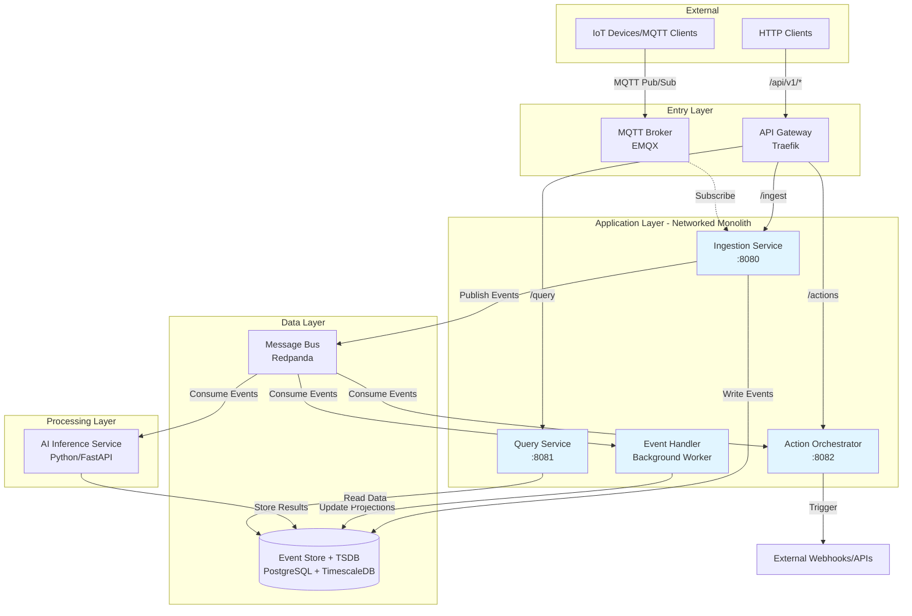
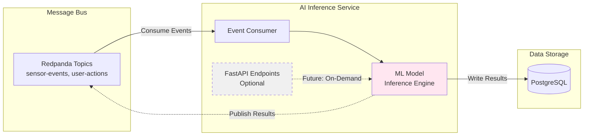

# ADR 0001: Initial Architecture Summary for Cornjacket Platform

* **Status:** Accepted
* **Date:** 2026-01-29
* **Architect:** [Your Name/Gemini]

## 1. Context and Problem Statement

### 1.1 Problem Statement
The Cornjacket platform is designed as a high-performance infrastructure for data 
ingestion, real-time AI inference, and event orchestration (initially targeting 
IoT or security streams). The goal is to practice advanced software engineering patterns including scalability, resilience, and "Security by Design."

The system must handle high-velocity "Write" traffic while remaining responsive to complex "Query" requests and AI-driven analysis.

### 1.2 Goals and Objectives
- Practice advanced software engineering patterns (CQRS, event-driven architecture)
- Build scalable, resilient system with "Security by Design"
- Create foundation for microservices migration
- Gain hands-on experience with production-grade technologies

### 1.3 Key Requirements
- Handle high-velocity "Write" traffic
- Remain responsive to complex "Query" requests
- Support real-time AI-driven analysis
- Enable event replay and multiple consumers

### 1.4 Constraints
- Development/learning environment (cost-conscious)
- Initial implementation as networked monolith
- AWS-focused deployment

## 1.5 Architecture Overview

### High-Level System Architecture


The Cornjacket platform follows an event-driven architecture with clear separation of concerns:

**Entry Layer:**
- API Gateway (Traefik) routes HTTP traffic to appropriate services
- MQTT Broker (EMQX) handles IoT device connections and pub/sub messaging

**Application Layer (Networked Monolith in Phase 1):**
- Ingestion Service validates and publishes incoming data
- Query Service provides read access to historical and real-time data
- Action Orchestrator triggers external actions based on events

**Data Layer:**
- Message Bus (Redpanda) decouples producers from consumers, provides backpressure management
- Event Store + TSDB (PostgreSQL + TimescaleDB) persists events and time-series data

**Processing Layer:**
- AI Inference Service consumes events for real-time anomaly detection and forecasting

### Data Flow Patterns

**Write Path (CQRS Command):**
1. HTTP/MQTT request → Gateway/Broker → Ingestion Service
2. Ingestion validates → Writes to Event Store (PostgreSQL)
3. Ingestion publishes → Message Bus (Redpanda)
4. Consumers (AI, Orchestrator) process asynchronously

**Read Path (CQRS Query):**
1. HTTP request → API Gateway → Query Service
2. Query Service reads from PostgreSQL/TimescaleDB
3. Returns aggregated or AI-enriched data

**Action Path:**
1. AI Service detects anomaly → Publishes to Message Bus
2. Action Orchestrator consumes → Triggers external webhooks/alerts


The Cornjacket platform follows...

## 2. Design Choices & Decisions

### 2.1 Entry Point Strategy: Parallel Entry (Best Approach)
* **Decision:** Separate the entry points for different protocols. Use an **Off-the-shelf API Gateway** (e.g., Kong, Traefik) for HTTP traffic and an **Off-the-shelf MQTT Broker** (e.g., EMQX) for stateful TCP IoT traffic.
* **Reasoning:** Protocol isolation prevents long-lived MQTT connections from consuming resources needed by short-lived HTTP requests. Using off-the-shelf tools ensures battle-tested security and protocol compliance.

### 2.2 Data Flow Pattern: Event-Driven Message Bus (Best Approach)
* **Decision:** Utilize a centralized **Message Bus** (e.g., Kafka or Redpanda) as the "unifier."
* **Reasoning:** Decouples ingestion from processing. It acts as a buffer (pressure valve) to protect downstream databases (TSDB) and AI services from traffic spikes (backpressure management).

### 2.3 Structural Philosophy: CQRS (Best Approach)
* **Decision:** Implement **Command Query Responsibility Segregation**. 
    * The **Ingestion Service** handles writes.
    * The **Query API** handles reads and data retrieval.
* **Reasoning:** Scaling requirements for writes (high-volume, low-latency) are fundamentally different from reads (complex aggregations, AI-enriched data). This prevents heavy queries from slowing down data ingestion.

### 2.4 AI Integration: In-Flight Inference (Best Approach)
* **Decision:** Deploy the AI Inference engine as a **Stream Processor/Consumer** on the message bus.
* **Reasoning:** Allows for real-time anomaly detection and predictive actions. Data is enriched *before* it hits the permanent storage (TSDB), enabling immediate responses via the Action Orchestrator.

### 2.5 Build vs. Buy: Hybrid Integration (Best Approach)
* **Decision:** Use off-the-shelf software for infrastructure (Gateway, Broker, Bus, TSDB). Develop **Custom Go Services** for business logic, ingestion validation, and action orchestration. Develop **Custom Python Services** for AI modeling.
* **Reasoning:** Focuses engineering effort on the unique architectural logic and AI implementation rather than reinventing standard networking protocols.

### 2.6 Deployment & Infrastructure - Development Environment

#### Decision: Networked Monolith with Sidecar Pattern
* **Architecture:** 
  - Single Go binary running multiple HTTP servers on different ports (8080, 8081, 8082)
  - Each port represents a future microservice (Ingestion, Query, Actions)
  - Traefik sidecar provides single entry point with path-based routing
  - EMQX sidecar for MQTT
  - No load balancer - direct task IP access

* **Reasoning:** 
  - Enforces service boundaries from day one
  - Routing configuration remains nearly identical when splitting to microservices
  - Minimal migration effort - extract servers to containers, update gateway targets
  - Realistic interface contracts despite monolithic deployment

* **Trade-offs:** 
  - Slightly more complex than single-port monolith
  - Sidecar overhead
  - Acceptable for learning proper architecture patterns

#### Complete Dev Task Architecture

**ECS Task Composition:**

| Container | Purpose | Ports | Volume Mounts |
|-----------|---------|-------|---------------|
| **traefik** | API Gateway / Router | 80 (HTTP entry), 8080 (dashboard) | Config volume |
| **app** | Go Monolith | 8080 (ingestion), 8081 (query), 8082 (actions) | None |
| **mqtt-broker** | EMQX MQTT Broker | 1883 (MQTT), 18083 (dashboard) | EFS/EBS for persistence |
| **redpanda** | Message Bus | 9092 (Kafka API), 8081 (admin) | EFS/EBS for persistence |
| **postgres** | Event Store + TSDB | 5432 (internal only) | EFS/EBS for persistence |

**Communication Patterns:**
- External → Traefik (port 80) → App ports (8080/8081/8082)
- External → MQTT (port 1883) → EMQX
- IoT devices → EMQX → App (subscribes to MQTT topics)
- App → Postgres (localhost:5432) - event store reads/writes
- App → Redpanda (localhost:9092) - publish events
- App → MQTT (localhost:1883) - subscribe to device messages

**Persistent Storage:**
- **Decision deferred:** EFS vs. EBS for container data persistence
- **Required for:** postgres (event store + time-series data), redpanda (message buffer), mqtt-broker (sessions/config)
- **Not required for:** app (stateless container, uses Postgres for data), traefik (config from volume)

**Resource Allocation (Dev):**
- **Allocation:** 1 vCPU, 2GB memory (total task)
- **Rationale:** Cost optimization for dev environment, acceptable slow performance
- **Monitoring:** Watch for memory pressure/thrashing via CloudWatch, scale up if needed
- **Decision deferred:** Per-container resource limits based on profiling

**Access Patterns:**
- HTTP API: `http://<task-ip>/api/v1/*`
- MQTT: `mqtt://<task-ip>:1883`
- Traefik Dashboard: `http://<task-ip>:8080`
- EMQX Dashboard: `http://<task-ip>:18083`

**Cost Estimate (Dev):**
- ECS Fargate: ~$30-40/month (1 vCPU, 2GB, running 24/7)
- EFS storage: ~$5-10/month
- Logs/metrics: ~$5/month
- **Total: ~$40-55/month**

### 2.7 Observability

#### Logging
* **Decision:** CloudWatch Logs with structured JSON format
* **Reasoning:** 
  - AWS-native integration with ECS (automatic log driver)
  - Structured JSON enables queryable logs and easier debugging
  - No additional infrastructure to manage in dev
* **Trade-offs:** CloudWatch query language less powerful than Elasticsearch, 
  but sufficient for dev environment

#### Metrics
* **Decision:** AWS CloudWatch Metrics (basic/automatic metrics)
* **Reasoning:** 
  - Zero setup - ECS provides CPU, memory, network metrics automatically
  - Sufficient for dev environment monitoring
  - Can add custom application metrics later via CloudWatch SDK
* **Trade-offs:** Less granular than Prometheus, acceptable for initial phase

#### Distributed Tracing
* **Decision:** Instrument code with OpenTelemetry, defer trace collection to later phase
* **Reasoning:** 
  - Adding instrumentation now is low-cost (library imports, trace context propagation)
  - Enables tracing across monolith's internal servers (port-to-port calls)
  - Honeycomb backend ready when needed (prior experience reduces learning curve)
  - Can enable/disable collection without code changes
* **Trade-offs:** Unused instrumentation adds minor overhead, but provides 
  migration path to full observability

#### Dashboards & Visualization
* **Decision:** Traefik dashboard for request routing + CloudWatch console for logs/metrics
* **Reasoning:** 
  - Traefik dashboard provides real-time view of traffic routing (validates gateway config)
  - CloudWatch console sufficient for ad-hoc log searches and metric viewing in dev
  - No additional infrastructure (Grafana) needed initially
* **Trade-offs:** Less sophisticated visualization than Grafana, acceptable for dev

## 3. Subsystem Overview

| Subsystem | Tech Category | Responsibility |
| :--- | :--- | :--- |
| **API Gateway** | Off-the-shelf | HTTP Auth, Rate-limiting, Routing. |
| **MQTT Broker** | Off-the-shelf | Managing IoT device connections and Pub/Sub. |
| **Message Bus** | Infrastructure | Central data pipeline (Kafka/Redpanda). |
| **Ingestion Service** | Custom (Go) | Validating and cleaning data; pushing to Bus. |
| **AI Inference** | Custom (Python) | In-flight anomaly detection and forecasting. |
| **TSDB** | Database | Long-term historical storage (InfluxDB/Timescale). |
| **Query API** | Custom (Go) | Serving data and AI insights via HTTP. |
| **Action Orchestrator**| Custom (Go) | Triggering webhooks/alerts based on AI logic. |

### 3.1 Message Bus

#### Technology Choice
* **Decision:** Kafka-compatible message bus (Redpanda)
* **Reasoning:** 
  - Kafka ecosystem is industry standard
  - Redpanda simpler than Kafka (no Zookeeper)
  - Compatible with standard Kafka client libraries
  - Works locally and in AWS

#### Deployment Architecture (Deferred)
* **Option A - Sidecar:** Redpanda container within monolith ECS task
  - Pros: Simpler deployment, single task to manage
  - Cons: Resource contention, coupled lifecycle
  - Requires: EFS volume mount for data persistence
  
* **Option B - Separate Service:** Redpanda as standalone ECS service
  - Pros: Independent scaling, clearer separation, easier debugging
  - Cons: Additional service to deploy
  - Requires: EBS or EFS for persistence

* **Decision deferred:** Will evaluate based on resource usage patterns and operational experience in dev

#### Data Persistence
* **Solution:** Mount persistent volume (EFS or EBS) to Redpanda container
* **Reasoning:** Message bus data survives container restarts, maintains buffer across deployments

### 3.2 Database & Event Store
* **Decision:** Single PostgreSQL instance with TimescaleDB extension
  - Serves as both event store (CQRS) and time-series database
  - Separate schemas for event store vs. time-series data

* **Deployment (Dev):** Postgres as sidecar container with persistent volume
  - Acceptable for low-traffic dev environment
  - Requires EFS/EBS mount for data persistence
  
* **Trade-offs:** 
  - Cannot scale event store and TSDB independently
  - Deferred decision: Separate instances for staging/prod if needed

### 3.3 Message Format

* **Decision:** JSON for initial development, migrate to binary format (Protobuf or MessagePack) for production
* **Reasoning:** 
  - JSON enables fast iteration on event schemas during development
  - Human-readable for debugging
  - No build tooling complexity initially
  - Binary format migration deferred until schema stabilizes and performance requirements are clear
* **Trade-offs:** 
  - Larger payload size in dev (acceptable for low volume)
  - Migration effort required later
  - Decision deferred: Protobuf vs. MessagePack based on schema stability needs and performance testing

### 3.4 AI Inference Service Framework

* **Decision:** Python service using FastAPI framework, operating as stream processor
* **Architecture Pattern:** Pure stream processor (Pattern A)
  - Consumes events from Redpanda continuously
  - Runs inference on ML models
  - Writes results to PostgreSQL or publishes back to Redpanda
  - FastAPI provides HTTP endpoints if on-demand queries needed later
* **Reasoning:** 
  - Python provides best ML/AI library ecosystem for experimentation
  - FastAPI enables both async event processing and HTTP API capability
  - Stream processing pattern supports real-time inference on incoming events
  - Framework choice supports future hybrid pattern (stream + on-demand API)
* **Trade-offs:** 
  - Python slower than compiled languages (acceptable for learning project)
  - Can migrate to Go-Python hybrid if performance becomes critical
* **Decision deferred:** 
  - Specific ML use case and models (anomaly detection, forecasting, classification, etc.)
  - Model deployment and versioning strategy
  - Whether to add on-demand API pattern (Pattern B) in addition to stream processing



## 4. Operational Details

### 4.1 Message Bus Configuration

#### Topic Design
* **Decision:** Per-event-type topics (sensor-events, user-actions, system-events)
* **Reasoning:** Clean separation, consumers subscribe to needed types, avoids topic explosion

#### Retention Policy
* **Decision:** 24 hours for dev environment
* **Reasoning:** Cost-effective, sufficient for testing and debugging

#### Partition Strategy
* **Decision:** 1 partition per topic for dev environment
* **Reasoning:** Simplest configuration, guaranteed ordering, sufficient for low-traffic dev
* **Decision deferred:** Multi-partition strategy for production based on volume requirements

#### Dead Letter Queue
* **Decision deferred:** Per-consumer implementation choice
* **Reasoning:** Different consumers have different failure handling needs (retry vs DLQ vs log-and-continue)

### 4.2 CQRS Data Flow & Consistency

* **Write Path (Command Side):**
  - Ingestion Service validates incoming requests
  - Writes events to Postgres Event Store (source of truth)
  - Publishes same events to Redpanda message bus

* **Read Path (Query Side):**
  - Event Handler consumes from Redpanda
  - Updates materialized projections in Postgres (optimized for queries)
  - Query Service reads from projections

* **Eventual Consistency:**
  - Write and read sides are eventually consistent
  - Lag between event written and projection updated (typically milliseconds)
  - Acceptable for dev environment
  - Decision deferred: Consistency requirements for production

* **Consumers:**
  - Event Handler: Updates CQRS projections
  - AI Inference Service: Real-time analysis
  - Action Orchestrator: Triggers webhooks/alerts
  - All consume same events independently

### 4.3 Action Orchestrator

The Action Orchestrator consumes events from the message bus and triggers external 
actions based on defined rules and conditions. This enables real-time responses to 
AI-detected anomalies and other critical events.

#### Example Action Flow

```mermaid
Note: Specific actions...
graph TD
    BUS[Redpanda Message Bus]
    
    subgraph "Action Orchestrator"
        CONSUME[Consume Events]
        EVAL[Evaluate Rules/Conditions]
        ROUTE[Route to Action Handlers]
    end
    
    subgraph "External Actions - Examples"
        SLACK[Slack Notification]
        PD[PagerDuty Incident]
        WH[Custom Webhook]
        EMAIL[Email Alert]
        API[Automation API]
    end
    
    BUS -->|AI Anomaly Events| CONSUME
    CONSUME --> EVAL
    EVAL -->|Trigger Actions| ROUTE
    
    ROUTE -.-> SLACK
    ROUTE -.-> PD
    ROUTE -.-> WH
    ROUTE -.-> EMAIL
    ROUTE -.-> API
    
    style EVAL fill:#fff4e6
```

Note: Specific actions...

Note: Specific actions and integrations are examples - actual implementation deferred 
to use case definition.

#### Webhook Retry Logic
* **Decision:** Exponential backoff with maximum retry attempts
  - Dev configuration: 3-5 retry attempts with delays (1s, 2s, 4s, 8s, 16s)
  - After max retries: Log failure and continue processing
* **Reasoning:** 
  - Industry standard pattern for handling transient failures
  - Prevents hammering failing endpoints
  - Provides visibility through logging in dev environment
* **Trade-offs:** 
  - Some webhooks may fail permanently (acceptable for dev)
  - No automatic recovery mechanism for consistently failing endpoints
* **Decision deferred:** 
  - Circuit breaker pattern for production (mark endpoints as down after repeated failures)
  - Operator dashboard for manual endpoint health management
  - Dead letter queue for failed webhooks requiring manual intervention

#### Timeout Handling
* **Decision:** 30-second timeout per webhook call
* **Reasoning:** 
  - Accommodates slow external services
  - Prevents indefinite blocking
  - Reasonable for dev testing with external APIs
* **Decision deferred:** Production timeout tuning based on SLA requirements

#### Rate Limiting
* **Decision:** Simple global rate limit (10 webhooks per minute)
* **Implementation:** In-memory tracking in Action Orchestrator service
* **Reasoning:** 
  - Protects external services from being overwhelmed
  - Prevents accidental spam during development and testing
  - Sufficient for single-instance dev environment
* **Decision deferred:** 
  - Per-endpoint rate limits for production
  - Shared state management (Redis) for multi-instance deployments

#### Deduplication
* **Decision:** Skip duplicate alerts within 5-minute window
* **Implementation:** In-memory cache of recent events (event type + target identifier)
* **Reasoning:** 
  - Prevents redundant notifications from repeated events
  - Reduces noise in alert channels
  - Simple implementation for dev environment
* **Trade-offs:** 
  - May suppress legitimate repeat alerts (acceptable for dev)
  - In-memory state lost on service restart (acceptable for dev)
* **Decision deferred:** 
  - Sophisticated deduplication logic (similarity matching, alert grouping)
  - Persistent deduplication state (Redis) for production multi-instance deployments

## 5. Scale & Performance Requirements

### 5.1 Target Throughput (Dev Environment)

* **Expected Load:** Low traffic (1-10 events/second)
  - HTTP API: ~10 requests/second
  - MQTT events: ~10 events/second
* **Reasoning:** Dev environment for testing and development, not production scale
* **Decision deferred:** Production throughput requirements based on actual use case and load testing

### 5.2 Latency Requirements (Dev Environment)

* **Ingestion latency:** < 500ms (HTTP request to accepted response)
* **End-to-end latency:** < 5 seconds (event received to projection updated)
* **Query latency:** < 1 second (query response time)
* **Reasoning:** 
  - Relaxed requirements appropriate for dev environment
  - Focus on correctness over performance
  - Eventual consistency acceptable
* **Decision deferred:** Production SLAs (p50, p95, p99 latency targets) based on business requirements

### 5.3 Data Retention Policies

* **Postgres Event Store:** 7 days
* **Postgres Projections/TSDB:** 7 days  
* **Redpanda Message Bus:** 24 hours
* **Reasoning:** 
  - Cost optimization for dev environment
  - Sufficient for testing and debugging
  - Event replay available within retention window
* **Decision deferred:** 
  - Production retention requirements (30/90/365 days or longer)
  - Archival strategy for long-term storage
  - Compliance/regulatory retention requirements

## 6. Security

### 6.1 Authentication & Authorization

#### HTTP API
* **Decision:** JWT-based authentication
* **Reasoning:** 
  - Industry standard token-based auth
  - Stateless (no session management needed)
  - Good practice for production readiness
* **Implementation:** JWT validation middleware in API Gateway (Traefik) or application layer
* **Decision deferred:** 
  - Authorization/RBAC policies
  - JWT token lifetime and refresh strategy
  - Identity provider integration

#### MQTT
* **Decision:** Username/password authentication (EMQX built-in)
* **Reasoning:** 
  - Simple, sufficient for dev environment
  - EMQX native support, no additional infrastructure
* **Decision deferred:** 
  - Client certificate authentication (mutual TLS) for production
  - Fine-grained ACL policies per device/topic

### 6.2 Secrets Management

* **Decision:** Hybrid approach based on environment
  - **Local development:** Environment variables from `.env` files
  - **AWS dev environment:** AWS Secrets Manager
* **Reasoning:** 
  - Local dev remains simple without AWS dependencies
  - AWS dev uses proper secrets management practices
  - Same application code supports both environments with fallback logic
  - Prepares migration path to production
* **Secrets managed:**
  - JWT signing keys
  - Database credentials
  - MQTT broker passwords
  - External service API keys
* **Decision deferred:** 
  - Secret rotation policies
  - Access audit logging
  - HashiCorp Vault evaluation for production

### 6.3 Network Security

#### Dev Environment Security Posture
* **Decision:** Relaxed security policies for development convenience
  - **Public exposure:** HTTP (port 80), MQTT (port 1883), dashboards (Traefik 8080, EMQX 18083)
  - **Internal only:** Postgres (5432), Redpanda (9092) - no public internet access
  - **Security groups:** Allow broad IP ranges for testing flexibility
  - **No TLS:** Plain HTTP and MQTT (simpler debugging in dev)
  - **No encryption at rest:** Unencrypted EFS volumes

* **Reasoning:** 
  - Development environment not exposed to production traffic
  - Simplified debugging and testing
  - Cost optimization (no certificate management)
  - Direct task IP access provides some obscurity

* **Decision deferred:** 
  - TLS/HTTPS for all HTTP traffic (production requirement)
  - MQTT over TLS (production requirement)
  - Encryption at rest for persistent volumes
  - Strict security group policies (least privilege)
  - VPC isolation and network segmentation
  - WAF and DDoS protection

## 7. Disaster Recovery

### 7.1 Backup Strategy

* **Decision:** No formal backup strategy for dev environment
* **Reasoning:** 
  - Dev environment data not business-critical
  - Test data can be regenerated as needed
  - Cost optimization (no backup storage costs)
  - Infrastructure-as-code (Terraform) enables rapid rebuild
* **Data at risk:**
  - Postgres: Event store and projections (7-day retention)
  - Redpanda: Message buffer (24-hour retention)
  - EMQX: Session and configuration data
* **Decision deferred:** 
  - Production backup strategy (automated snapshots, point-in-time recovery)
  - Backup retention policies
  - Cross-region backup replication

### 7.2 Recovery Procedures

* **Decision:** Manual recovery via infrastructure rebuild
* **Recovery approach:**
  1. Redeploy infrastructure using Terraform
  2. Deploy latest application containers
  3. Regenerate test data using seed scripts
* **Reasoning:** 
  - Simple, repeatable process for dev
  - Infrastructure-as-code provides disaster recovery documentation
  - Acceptable downtime for non-production environment
* **Decision deferred:** 
  - Automated failover mechanisms
  - Blue-green deployment for zero-downtime recovery
  - Runbooks for production incident response

### 7.3 Recovery Objectives

* **RTO (Recovery Time Objective):** No strict requirement
  - Acceptable: Several hours to redeploy from scratch
  - Manual intervention acceptable
* **RPO (Recovery Point Objective):** No strict requirement  
  - Data loss acceptable in dev environment
  - Can regenerate test datasets
* **Reasoning:** 
  - Dev environment not serving production traffic
  - Learning/experimentation focus over availability
* **Decision deferred:** 
  - Production RTO/RPO targets based on business requirements
  - SLA commitments
  - Disaster recovery testing procedures

## 8. Consequences

### 8.1 Benefits

**Architectural Learning:**
- Hands-on experience with event-driven architecture, CQRS, and microservices patterns
- Practice with industry-standard technologies (Kafka-compatible systems, time-series databases)
- Enforced service boundaries from day one through networked monolith approach

**Scalability Foundation:**
- Message bus enables independent scaling of consumers
- CQRS separates read/write workloads for optimization
- Clear migration path from monolith to microservices with minimal code changes

**Operational Flexibility:**
- Multiple consumers process same events independently
- Event replay capability within retention window
- Decoupled components reduce blast radius of failures

**Real-time Capabilities:**
- AI inference on streaming data
- Immediate action orchestration based on events
- Low-latency ingestion path

### 8.2 Trade-offs and Challenges

**Complexity:**
- Distributed system debugging harder than monolith (multiple containers, async processing)
- Eventual consistency between write and read sides requires careful handling
- More moving parts (5 containers in dev task vs. simple monolith)

**Operational Overhead:**
- Multiple technologies to learn and manage (Redpanda, Postgres, EMQX, Traefik)
- Container orchestration and sidecar pattern adds deployment complexity
- Monitoring and observability across distributed components
- In-memory state management (rate limiting, deduplication) lost on restart

**Cost:**
- Dev environment: ~$40-55/month for always-running infrastructure
- Higher than simple monolith or serverless approach
- Multiple managed services add cost in production

**Development Velocity:**
- Slower initial development due to architectural setup
- More ceremony around adding new features (multiple services to update)
- Testing distributed flows more complex than testing single process

**Resource Constraints (Dev):**
- 1 vCPU, 2GB memory shared across 5 containers
- Potential for slow performance or thrashing under load
- May need to scale up resources during development

### 8.3 Migration Considerations

**Monolith to Microservices:**
- Low-risk migration: Extract services one at a time
- Routing config changes, minimal code refactoring
- Can run hybrid (some services extracted, some still in monolith)

**Technology Migrations:**
- JSON → Protobuf: Requires schema definition and coordinated deployment
- ECS → Kubernetes: Infrastructure rewrite, but containerized apps portable
- In-memory state → Redis: Needed for multi-instance production deployments

### 8.4 Risk Mitigation

**Performance Risks:**
- Monitor CloudWatch metrics for memory pressure
- Ready to scale Fargate task resources if needed
- Defer optimization until proven bottlenecks identified

**Operational Risks:**
- Infrastructure-as-code (Terraform) enables repeatable deployments
- Comprehensive logging via CloudWatch for debugging
- Relaxed dev security acceptable given non-production environment

**Cost Risks:**
- 7-day retention limits storage costs
- Single task deployment minimizes compute costs
- Can shut down dev environment when not in use
