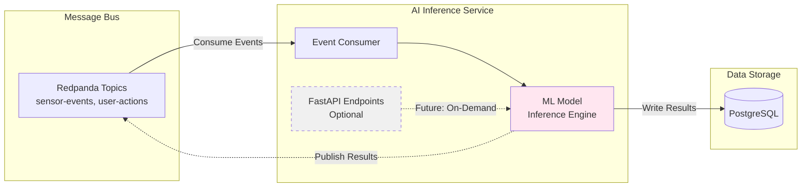

# ADR 0009: AI Inference Stream Processor

* **Status:** Accepted
* **Date:** 2026-01-29
* **Architect:** David

## Context

The platform requires real-time AI inference on streaming data for anomaly detection, forecasting, and predictive actions. The AI component must integrate with the event-driven architecture and provide sub-second response times.

## Decision

### Integration Pattern: In-Flight Inference

| Aspect | Decision |
|--------|----------|
| **Pattern** | Stream Processor / Consumer on the message bus |
| **Data Flow** | Consume events → Run inference → Write results or publish back |
| **Timing** | Data enriched *before* hitting permanent storage (TSDB) |

**Rationale:**
- Allows for real-time anomaly detection and predictive actions
- Enables immediate responses via the Action Orchestrator
- Data is processed as it flows through the system, not in batch

### Framework: Python with FastAPI

| Aspect | Decision |
|--------|----------|
| **Language** | Python |
| **Framework** | FastAPI |
| **Architecture** | Pure stream processor (Pattern A) |

**Architecture Pattern:**
- Consumes events from Redpanda continuously
- Runs inference on ML models
- Writes results to PostgreSQL or publishes back to Redpanda
- FastAPI provides HTTP endpoints if on-demand queries needed later

**Rationale:**
- Python provides best ML/AI library ecosystem for experimentation
- FastAPI enables both async event processing and HTTP API capability
- Stream processing pattern supports real-time inference on incoming events
- Framework choice supports future hybrid pattern (stream + on-demand API)

**Trade-offs:**
- Python slower than compiled languages (acceptable for learning project)
- Can migrate to Go-Python hybrid if performance becomes critical

### Deployment

| Environment | Deployment |
|-------------|------------|
| **AWS dev** | Sidecar container within the ECS task |
| **Local dev** | Runs natively on host (`uvicorn` / `python main.py`) |

### Data Flow

### Output Paths

| Path | Description |
|------|-------------|
| **Write to PostgreSQL** | Store inference results for query service access |
| **Publish to Redpanda** | Trigger downstream actions (Action Orchestrator) |
| **Both** | Store results AND trigger actions |

## Consequences

### Benefits
- Real-time inference on streaming data
- Flexible output options (store, publish, or both)
- Python ecosystem enables rapid ML experimentation
- Framework supports future HTTP API addition without rewrite

### Trade-offs
- Python performance overhead (acceptable for dev scale)
- Another container/process to manage
- Need to handle consumer failures (see ADR-0004)

### Deferred Decisions
- Specific ML use case and models (anomaly detection, forecasting, classification, etc.)
- Model deployment and versioning strategy
- Whether to add on-demand API pattern (Pattern B) in addition to stream processing
- Go-Python hybrid architecture if performance requires it

## Related ADRs
- ADR-0001: Event-Driven CQRS Architecture
- ADR-0004: Error Handling Philosophy
- ADR-0005: Infrastructure Technology Choices
